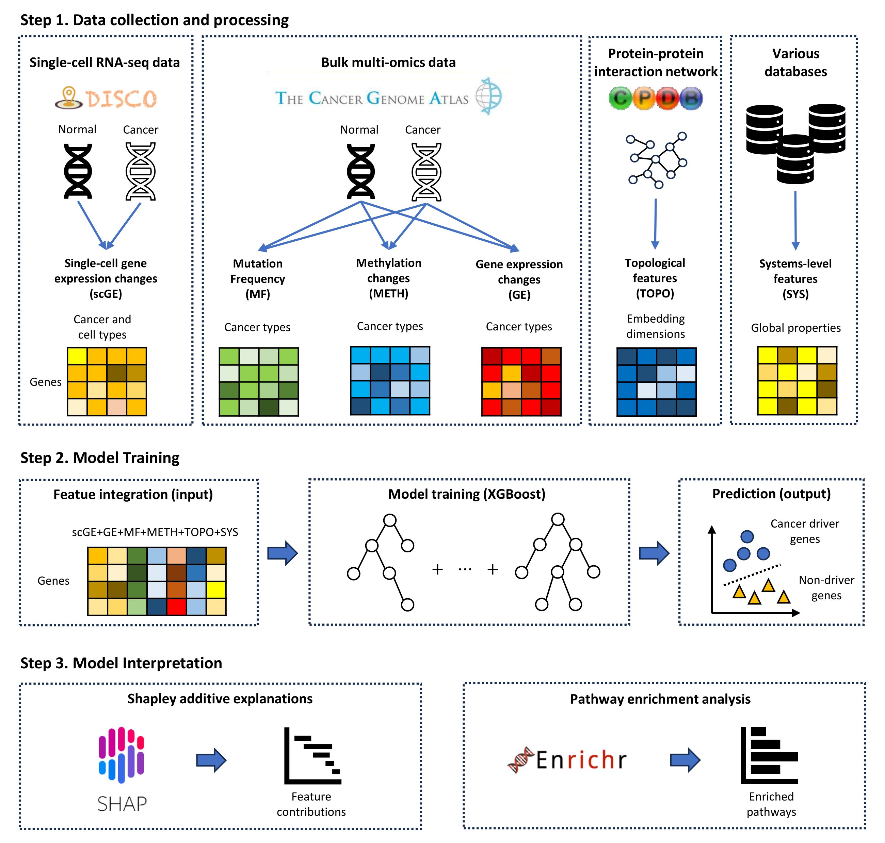

# scCDX: enhancing cancer driver gene identification and model interpretability with single-cell RNA sequencing data and extreme gradient boosting



## Installation

```bash
conda create -n $ENV_NAME python=3.11
conda activate $ENV_NAME
python -m venv $VENV_PATH
$VENV_PATH/bin/pip install -U pip setuptools
$VENV_PATH/bin/pip install poetry
$VENV_PATH/bin/poetry install
```


## Experiments

### Data preprocessing

- Protein-protein interaction network & scRNA-seq
Following command downloads scRNA-seq files under the `DISCOtmp/`.
```bash
python -m src.preprocessing
```

- Topological Features
Preprocessed topological features file is in the `data/feature/TOPO.pkl`.
```bash
python -m src.deepwalk --num-workers $NUM_WORKERS
```


### Train & Test
Hyperparameter tuning log files will be located under the `logs/`.
Test result files will be located under the `test/`.
```bash
python -W ignore -m src.crossvalid --mode train --model xgb --omics MF+METH+GE+SYS+TOPO+scRaw_all+nonzero_mean
python -W ignore -m src.crossvalid --mode independent --model xgb --omics MF+METH+GE+SYS+TOPO+scRaw_all+nonzero_mean
```


### Baselines
For GNN-based state-of-the-art methods, run the commands in [here](./baselines/README.md).
You can train and test `mlp`, `tabnet`, `rf`, `svm` by the following commands:
```bash
python -W ignore -m src.crossvalid --mode train --model $MODEL --omics MF+METH+GE+SYS+TOPO+scRaw_all+nonzero_mean
python -W ignore -m src.crossvalid --mode independent --model $MODEL --omics MF+METH+GE+SYS+TOPO+scRaw_all+nonzero_mean
```

To run TabNet model, you should install different pacakges
```bash
conda env create -n $ENV_NAME -f tabnet_env.yml
conda activate $ENV_NAME
```
